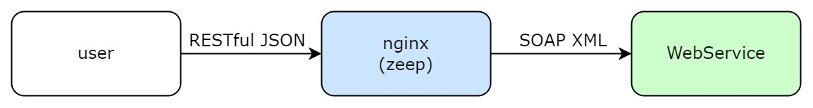

# lua-resty-ffi-soap

The openresty SOAP to REST library based on [zeep](https://docs.python-zeep.org/en/master/).

> Zeep inspects the WSDL document and generates the corresponding code to use the services and types in the document. This provides an easy to use programmatic interface to a SOAP server.



**Callflow:**


https://docs.python-zeep.org/en/master/client.html#the-serviceproxy-object

> The ServiceProxy object is a simple object which will check if an operation exists for attribute or item requested. If the operation exists then it will return an OperationProxy object (callable) which is responsible for calling the operation on the binding.

**Highlights:**

* no conversion template, no WSDL compile, zero code

  Almost all gateway products that support SOAP-to-REST require you to write transformation templates for requests and responses,
e.g. [tyk](https://tyk.io/docs/advanced-configuration/transform-traffic/soap-rest/), [Gloo Edge](https://docs.solo.io/gloo-edge/latest/guides/traffic_management/request_processing/transformations/xslt_transformation/). However, zeep can free you from such manual work. It provides a one-to-one mapping between JSON and SOAP for requests and responses.

* fully asynchronous

[lua-resty-ffi](https://github.com/kingluo/lua-resty-ffi) provides an efficient and generic API to do hybrid programming
in openresty with mainstream languages (Go, Python, Java, Rust, Nodejs).

**lua-resty-ffi-soap = lua-resty-ffi + zeep**

## Synopsis

**Client Config:**

* wsdl_url: WSDL URL, could be any valid URL, https scheme or not

```lua
local client, err = soap.new({
    wsdl_url = "http://localhost:8080/ws?wsdl=foobar",
})
```

**Call Operation:**

* operation: operation name
* body: an JSON-serializable table

```lua
local ok, res, err = client:do({
    operation = "foobar",
    body = {
        foo = "bar",
        bar = 6,
    }
})
```

**Operation Result:**

One of below fields:

* response: an JSON-serializable table, which represents the normal response
* fault: an JSON-serializable table, which represents the fault

Response example:

```xml
<SOAP-ENV:Envelope xmlns:SOAP-ENV="http://schemas.xmlsoap.org/soap/envelope/">
  <SOAP-ENV:Header></SOAP-ENV:Header>
  <SOAP-ENV:Body>
    <ns2:getCountryResponse xmlns:ns2="http://spring.io/guides/gs-producing-web-service">
      <ns2:country>
        <ns2:name>Spain</ns2:name>
        <ns2:population>46704314</ns2:population>
        <ns2:capital>Madrid</ns2:capital>
        <ns2:currency>EUR</ns2:currency>
      </ns2:country>
    </ns2:getCountryResponse>
  </SOAP-ENV:Body>
</SOAP-ENV:Envelope>
```

output lua table:

```lua
{
  response = {
    capital = "Madrid",
    currency = "EUR",
    name = "Spain",
    population = 46704314
  },
}
```

Fault example:

```xml
<SOAP-ENV:Envelope xmlns:SOAP-ENV="http://schemas.xmlsoap.org/soap/envelope/">
  <SOAP-ENV:Header></SOAP-ENV:Header>
  <SOAP-ENV:Body>
    <SOAP-ENV:Fault>
      <faultcode>SOAP-ENV:Server</faultcode>
      <faultstring xml:lang="en">Your name is required.</faultstring>
    </SOAP-ENV:Fault>
  </SOAP-ENV:Body>
</SOAP-ENV:Envelope>
```

output lua table:

```lua
{
  fault = {
    message = "Your name is required.",
    code = "SOAP-ENV:Server",
  },
}
```

## Demo

### Setup lua-resty-ffi-soap

```bash
# install lua-resty-ffi
# https://github.com/kingluo/lua-resty-ffi#install-lua-resty-ffi-via-luarocks
# set `OR_SRC` to your openresty source path
luarocks config variables.OR_SRC /tmp/tmp.Z2UhJbO1Si/openresty-1.21.4.1
luarocks install lua-resty-ffi

# make lua-resty-ffi python loader library
apt install python3-dev python3-pip libffi-dev
cd /opt
git clone https://github.com/kingluo/lua-resty-ffi
cd /opt/lua-resty-ffi/examples/python
make

# install deps
cd /opt
git clone https://github.com/kingluo/lua-resty-ffi-soap
cd /opt/lua-resty-ffi-soap
pip3 install -r requirements.txt

# run nginx
cd /opt/lua-resty-ffi-soap/demo
PATH=/opt/resty_ffi/nginx/sbin/:$PATH \
LD_LIBRARY_PATH=/opt/lua-resty-ffi/examples/python:/usr/local/lib/lua/5.1 \
PYTHONPATH=/opt/lua-resty-ffi-soap \
nginx -p $PWD -c nginx.conf

# run WebService demo
apt install openjdk-17-jdk
git clone https://github.com/spring-guides/gs-soap-service.git
cd gs-soap-service/complete
./mvnw spring-boot:run
```

### Create client

```bash
curl http://localhost:20000/create_client -X POST -d '{
    "wsdl_url": "http://localhost:8080/ws/countries.wsdl",
}' -s | jq
```

ouput:

```json
{
  "client": 1
}
```

### Call getCountry operation

```bash
curl 'http://localhost:20000/operation?client=1&operation=getCountry' -X POST \
-d '{"name": "Spain"}' -s | jq
```

output:

```json
{
  "response": {
    "currency": "EUR",
    "population": 46704314,
    "capital": "Madrid",
    "name": "Spain"
  }
}
```

### Close client

```bash
curl http://localhost:20000/close_client?client=1
```
